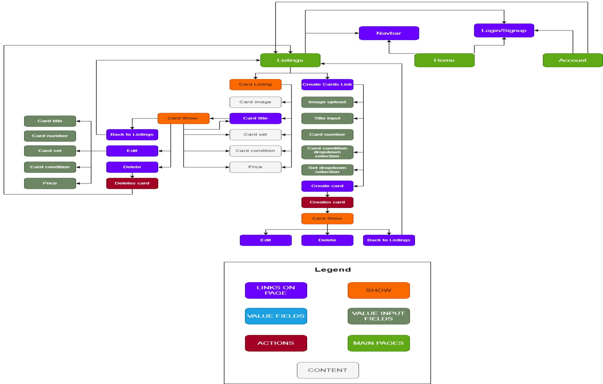
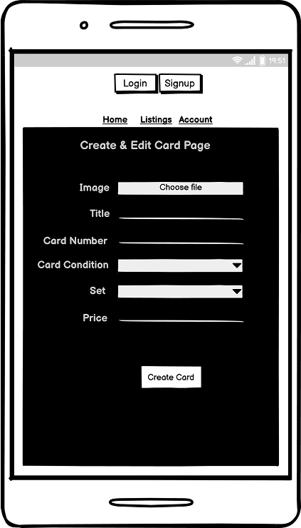
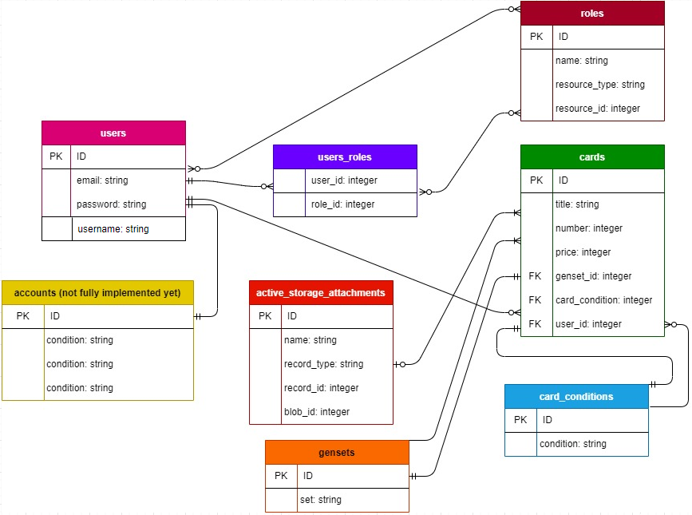

# **Question 7 - Identification of the problem you are trying to solve by building this particular marketplace app.**

The problem I’m trying to solve is the sometimes confusing and frustrating task of completing a gen 1 pokémon set collection.

# **Question 8 - Why is it a problem that needs solving?**

My Marketplace app solves this by only having gen 1 cards. So, there’s no getting confused by all the different generations and sets, like on other pokémon marketplaces.

# **Question 9 - A link (URL) to your deployed app (i.e. website)**

[PokeMart](https://rails-marketplace-app-t2a2.herokuapp.com/)

# **Question 10 - A link to your GitHub repository (repo)**

[GitHub](https://github.com/Tia-Koenig/TiaKoenig-T2A2)

# **Question 11 - Description of your marketplace app (website).**

## **Purpose**

The purpose of this app is to help people complete their first-generation pokemon sets; my app allows the user to look through, sell and purchase only first-generation pokemon cards. My app makes it easy because there aren't any other card generations to potentially confuse the user.

## **Functionality / features**

## **Sitemap**

## **Screenshots**

## **Target audience**

My target audience is people looking to complete their generation one pokemon card set, or sell their collection.

## **Tech stack (e.g. html, css, deployment platform, etc)**

- Ruby on rails
- Ruby
- HTML
- CSS
- PostgreSQL
- Cloudinary
- Stripe
- Github

# **Question 12 - User Stories**

- A user that is not logged in can view the homepage and listings page, if they try to view a card, they will be redirected to the Login page and can either signup or login.
- A user that is logged in can create listings
- A user can upload an image of the card they're selling when creating a listing
- A user can edit or delete their own card listing
- A user can click on the card title of any listing to view more details
- A user can buy a listing, after completing payment in stripe they will be redirected to the successful purchase page, if the order is cancelled, they will be redirected to the cancelled purchase page.

# **Question 13 - Wireframes for your app**

## **Desktop**

<!--  -->

## **Tablet**

<!--  -->

## **Mobile**

<!--  -->

# **Question 14 - An ERD for your app**

# **Question 15 - Explain the different high-level components (abstractions) in your app**

# **Question 16 - Detail any third party services that your app will use**

### **Heroku**

Heroku is a container-based cloud platform that developers use to deploy and manage apps.

### **Stripe**

Stripe is a payment processing platform that is used to set up efficient and safe payments in applications. 

### **Cloudinary**

Cloudinary provides a cloud based management system for images on my application.

### **PostgreSQL**

PostgreSQL is an open source DBMS, it's being used to store information from the application.

# **Question 17 - Describe your projects models in terms of the relationships (active record associations) they have with each other**

### **Cards**

A Card belongs to a User, if the User deletes their account, their Card will be destroyed.
A Card has One GenSet
A Card has one CardCondition
A Card has One image attached

### **Users**

A User can have Many Cards, if the User deletes their account, their Card will be destroyed.

????????????
A User can have One or many Roles
????????????

### **GenSet**
GenSet has many Cards

### **CardCondition**
CardCondition has Many Cards

### **Role**

A Role Has and Belongs To Many Users

# **Question 18 - Discuss the database relations to be implemented in your application**

# **Question 19 - Provide your database schema design**

????????????

# **Question 20 - Describe the way tasks are allocated and tracked in your project**

<!-- take photos of book with todo lists -->
